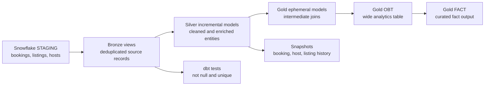

# Airbnb Analytics Platform with dbt and Snowflake

~An analytics engineering project that transforms Airbnb booking, listing, and host data in Snowflake using dbt.~

The project demonstrates a layered warehouse design, incremental processing, deduplication, reusable Jinja macros, data quality tests, snapshots for history, and curated analytical outputs.

## Project Highlights

- Declares Snowflake staging tables as dbt sources.
- Builds Bronze views that standardize source access and remove duplicate records.
- Builds Silver incremental models with merge strategy and schema evolution support.
- Uses ephemeral models to prepare reusable intermediate datasets.
- Produces Gold fact and one-big-table outputs for analytics consumption.
- Captures historical changes with dbt snapshots.
- Adds primary-key tests with `not_null` and `unique` assertions.
- Uses Jinja macros to centralize repeated SQL logic.
- Keeps transformations, documentation, tests, and lineage together in the dbt project.

## Architecture



### Medallion layers

| Layer    | dbt object type             | Purpose                                                                    |
| -------- | --------------------------- | -------------------------------------------------------------------------- |
| Source   | Source declarations         | Connects dbt to `AIRBNB.STAGING` tables.                                   |
| Bronze   | Views                       | Reads source data and keeps the latest record per business key.            |
| Silver   | Incremental tables          | Applies business logic and updates existing records using merge semantics. |
| Gold     | Tables and ephemeral models | Serves analytics-ready fact and wide-table use cases.                      |
| Snapshot | Snapshots                   | Preserves historical versions of changing records.                         |

## Data Flow

The project starts with three Snowflake staging tables:

- `AIRBNB.STAGING.bookings`
- `AIRBNB.STAGING.listings`
- `AIRBNB.STAGING.hosts`

Bronze models use `source()` references and deduplicate records with a window function. For example, bookings keep the most recent row for each `booking_id`:

```sql
SELECT *
FROM {{ source('staging', 'bookings') }}
QUALIFY ROW_NUMBER() OVER (
		PARTITION BY booking_id
		ORDER BY created_at DESC
) = 1
```

Silver models use `ref()` dependencies and incremental processing. The bookings model calculates a total booking amount and processes only records newer than the latest loaded timestamp during incremental runs:

```sql
{{ config(
		materialized='incremental',
		unique_key='booking_id',
		incremental_strategy='merge'
) }}


		WHERE created_at > (
				SELECT COALESCE(MAX(created_at), '1900-01-01')
				FROM {{ this }}
		)

```

The Gold layer provides two consumption patterns:

- `obt`: a wide, joined table containing booking, listing, and host attributes.
- `fact`: a focused fact output built from the Gold OBT.

## Repository Structure

```text
.
|-- README.md
|-- pyproject.toml
|-- main.py
`-- aws_dbt_snowflake_project/
		|-- dbt_project.yml
		|-- profiles.yml
		|-- analyses/
		|-- macros/
		|-- models/
		|   |-- sources/
		|   |-- bronze/
		|   |-- silver/
		|   `-- gold/
		|       `-- ephemeral/
		|-- snapshots/
		|-- tests/
		|-- seeds/
		`-- analyses/
```

Important project files:

- [dbt_project.yml](aws_dbt_snowflake_project/dbt_project.yml): project configuration, paths, and default materializations.
- [sources.yml](aws_dbt_snowflake_project/models/sources/sources.yml): Snowflake source declarations.
- [bronze_bookings.sql](aws_dbt_snowflake_project/models/bronze/bronze_bookings.sql): source deduplication pattern.
- [silver_bookings.sql](aws_dbt_snowflake_project/models/silver/silver_bookings.sql): incremental bookings transformation.
- [obt.sql](aws_dbt_snowflake_project/models/gold/obt.sql): Gold wide-table construction.
- [fact.sql](aws_dbt_snowflake_project/models/gold/fact.sql): Gold fact output.
- [dim_bookings.yml](aws_dbt_snowflake_project/snapshots/dim_bookings.yml): booking history snapshot configuration.
- [bronze_properties.yml](aws_dbt_snowflake_project/models/bronze/bronze_properties.yml): Bronze model documentation and tests.
- [silver_properties.yml](aws_dbt_snowflake_project/models/silver/silver_properties.yml): Silver model configuration and tests.
- [multiply.sql](aws_dbt_snowflake_project/macros/multiply.sql): reusable calculation macro.
- [trimmer.sql](aws_dbt_snowflake_project/macros/trimmer.sql): reusable text-cleaning macro.

## dbt Configuration

The project is configured with the following defaults:

```yaml
models:
	aws_dbt_snowflake_project:
		bronze:
			+materialized: view
		silver:
			+materialized: incremental
		gold:
			+materialized: table
```

Silver models also explicitly use:

- `unique_key` for merge matching.
- `incremental_strategy: merge` for upserts.
- `on_schema_change: append_new_columns` for additive schema changes.

## Prerequisites

- Python 3.10 or a compatible Python version.
- A Snowflake account with access to the `AIRBNB` database.
- Snowflake staging tables for bookings, listings, and hosts.
- A Snowflake user, role, warehouse, and authentication method.
- dbt Core and the `dbt-snowflake` adapter.

## Local Setup

Create and activate the project virtual environment from the repository root:

```powershell
python -m venv .venv
\.venv\Scripts\Activate.ps1
```

Install the project dependencies from [pyproject.toml](pyproject.toml), or install the dbt adapter directly:

```powershell
pip install dbt-snowflake
```

The dbt project is nested under `aws_dbt_snowflake_project`, so run dbt commands from that directory:

```powershell
cd .\aws_dbt_snowflake_project
dbt debug --profiles-dir .
dbt deps --profiles-dir .
dbt build --profiles-dir .
```

Alternatively, run from the repository root with explicit paths:

```powershell
dbt build `
	--project-dir .\aws_dbt_snowflake_project `
	--profiles-dir .\aws_dbt_snowflake_project
```

Useful focused commands:

```powershell
dbt parse --project-dir .\aws_dbt_snowflake_project --profiles-dir .\aws_dbt_snowflake_project
dbt run --select silver_bookings --profiles-dir .
dbt test --select silver_bookings --profiles-dir .
dbt snapshot --profiles-dir .
dbt docs generate --profiles-dir .
dbt docs serve --profiles-dir .
```

## Security and Configuration

Do not commit passwords, private keys, tokens, or production credentials. Keep local credentials outside the repository where possible and use environment variables or a secure secrets manager for shared and production environments.

The committed `profiles.yml` is included to document the expected Snowflake profile shape. Replace account, user, key paths, warehouse, database, schema, and role values with your own environment-specific settings before running the project.

## Data Quality

The project currently validates business keys in Bronze and Silver models:

- Booking IDs are not null and unique.
- Host IDs are not null and unique.
- Listing IDs are not null and unique.

Run all model builds and tests together with:

```powershell
dbt build --profiles-dir .
```

`dbt build` runs models, tests, snapshots, and seeds in dependency order where applicable, making it a useful CI entry point.

## Current Scope and Next Steps

Potential extensions for a production-ready version include:

- Add freshness checks and source-level tests.
- Add accepted-value and relationship tests for important dimensions.
- Add CI execution with `dbt build` on pull requests.
- Add a documented deployment target separate from local development.
- Add model exposures for dashboards or downstream consumers.
- Add performance and cost monitoring for incremental models.

## License

This project is intended for learning and internal development. Add a license before redistributing it as a public software project.
